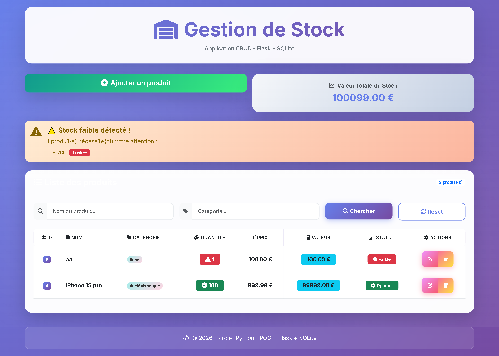

# 📦 Gestion de Stock - CRUD Flask

[](https://gestion-stock-flask-production.up.railway.app/)
[](https://gestion-stock-flask-production.up.railway.app/)

**Essayez l'application en ligne** → https://gestion-stock-flask-production.up.railway.app/

Application web de gestion de stock avec interface moderne (Bootstrap 5).  
POO Python + Flask + SQLite + HTML/CSS.



## ✨ Fonctionnalités

- ✅ CRUD complet (Ajouter/Modifier/Supprimer/Rechercher)
- ✅ Stockage persistant avec SQLite (fichier `stock.db` créé automatiquement)
- ✅ Alertes visuelles quand le stock est faible (badge rouge)
- ✅ Calcul automatique de la valeur totale du stock
- ✅ Recherche multi-critères (nom + catégorie)
- ✅ Design responsive (mobile/tablette/PC)

## 🌐 Démo en ligne

Pas besoin d'installer quoi que ce soit — testez directement :

🔗 **https://gestion-stock-flask-production.up.railway.app/**

> 💡 *Note : Les données sont réinitialisées automatiquement toutes les 24h sur Railway (version gratuite).*

## 🚀 Installation & Lancement (en local)

```bash
# 1. Cloner le dépôt
git clone https://github.com/Salaheddine0201/gestion-stock-flask.git
cd gestion-stock-flask

# 2. Créer un environnement virtuel
python -m venv venv

# Windows :
venv\Scripts\activate

# Mac/Linux :
source venv/bin/activate

# 3. Installer les dépendances
pip install -r requirements.txt

# 4. Lancer l'application
flask run